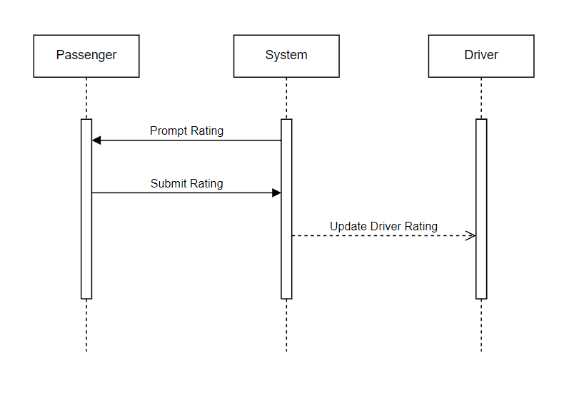

    
     

<h2 align="center">Real time Ride-Sharing Service</h2>

**Business Requirements:**
- **Problem Definition:** Riksha aims to provide a real time ride-sharing service that efficiently matches passengers with drivers, considering factors like location, traffic, and dynamic pricing.
- **Functionalities:**
  - Passenger registration and login.
  - Driver registration and approval process.
  - Ride request and matching algorithm.
  - Dynamic pricing based on demand and traffic.
  - Payment processing and receipt generation.
  - Real-time GPS tracking of rides.
  - Rating and feedback system for passengers and drivers.
- **Target Users:**
  - Passengers needing reliable and quick transportation.
  - Drivers looking to offer their services through a flexible platform.
- **Business Goals:**
  - Provide a scalable and reliable service.
  - Optimize operational costs while ensuring quality.
  - Maintain a high level of customer satisfaction.

**Non-Functional Requirements:**
- **Performance:**
  - Scalability to handle up to millions of users.
  - Response time under 2 seconds for critical operations.
- **Security:**
  - Authentication via OAuth2 for secure access.
  - Authorization based on roles (admin, driver, passenger, customer support).
  - Data encryption for all sensitive information.
- **Maintainability:**
  - Modular code structure to allow for easy updates and feature additions.
  - Comprehensive documentation and unit tests.
- **Additional Requirements:**
  - Compliance with local transportation regulations.
  - Integration with external services like Google Maps API.

### Use Case Diagram:

#### Actor Classification:
| Type      | Actor         | Goal Description                                                               |
|-----------|---------------|--------------------------------------------------------------------------------|
| **Primary** | Passenger     | Book a ride, make a payment, and rate the ride.                                 |
| **Primary** | Driver        | Accept a ride request, complete the ride, and receive payment.                    |
| **Primary** | Admin         | Manage system operations, users, and handle disputes.                            |
| **Supporting** | Payment Processor | Process payments, refunds, and handle transaction issues.                       |
| **Supporting** | GPS Service   | Provide real-time location data for route optimization and tracking.              |
| **Offstage** | Marketing Team | Analyze user data for targeted promotions and growth strategies.              |
| **Offstage** | Customer Support | Resolve passenger and driver issues, handle complaints, and provide assistance. |
| **Offstage** | Maintenance Team | Ensure the app and server infrastructure are functioning smoothly.               |

### Use Case Names:

- **Request Ride** - Involves Passenger and Driver.
- **Accept Ride** - Involves Passenger and Driver.
- **Start the Ride** - Involves Passenger and Driver.
- **Rate The Ride** - Involves Passenger.
- **Verify Driver Info** - Involves Passenger and Driver.
- **Provide Customer Support** - Involves Passenger, Driver, and Customer Support.

### Classes

- **User:** Attributes: `userID`, `name`, `phoneNumber`, `email`, `location` `userType` (Driver/Passenger)
- **Driver:** Attributes: `driverID`, `licenseNumber`, `vehicleDetails`, `rating`, `status` (Available/Unavailable)
- **Passenger:** Attributes: `passengerID`, `paymentMethod`, `rideHistory`
- **Ride:** Attributes: `rideID`, `startLocation`, `endLocation`, `fare`, `rideStatus`, `route`, `timestamp`
- **Vehicle:** Attributes: `vehicleID`, `vehicleType`, `registrationNumber`, `capacity`, `driver`
- **Payment:** Attributes: `paymentID`, `amount`, `paymentMethod`, `status`, `transactionTimestamp`
- **Route:** Attributes: `routeID`, `startPoint`, `endPoint`, `waypoints`, `estimatedTime`
- **Rating:** Attributes: `ratingID`, `rideID`, `userID`, `score`, `feedback`
- **Notification:** Attributes: `notificationID`, `userID`, `message`, `timestamp`
- **Feedback:** Attributes: `feedbackID`, `rating`, `comments`

Figure 1: UML for Use Cases

### Use Case 1: Request Ride

- **Use Case Name:** Request Ride
- **Scope:** Riksha Ride-Sharing Application
- **Level:** User Goal
- **Primary Actor:** Passenger
- **Supporting Actor:** Driver
- **Stakeholders and Interests:**
  - **Passenger:** Wants to quickly and conveniently book a ride.
  - **Driver:** Wants to receive ride requests to earn income.
  - **Riksha Administration:** Aims to facilitate seamless ride bookings and maximize utilization.
- **Preconditions:**
  - The passenger is logged into the app and has a valid payment method on file.
- **Success Guarantee:**
  - The ride is successfully requested, and a driver is assigned.
- **Main Success Scenario:**
  1. The passenger opens the app and enters the destination.
  2. The system calculates the estimated fare and displays it to the passenger.
  3. The passenger confirms the request.
  4. The system searches for available drivers nearby.
  5. A driver accepts the request.
  6. The system notifies the passenger of the assigned driver’s details.
- **Extensions:**
  - No drivers are available:
    - The system notifies the passenger that no drivers are currently available and suggests trying again later.
- **Special Requirements:**
  - The system must provide real-time availability of drivers.
  - The estimated fare should account for current traffic conditions and dynamic pricing.
- **Postconditions:**
  - The ride request is recorded in the system.
  - The passenger and driver are connected via the app.

### Use Case 2: Accept Ride

- **Use Case Name:** Accept Ride
- **Scope:** Riksha Ride-Sharing Application
- **Level:** User Goal
- **Primary Actor:** Driver
- **Supporting Actor:** Passenger
- **Stakeholders and Interests:**
  - **Driver:** Wants to accept ride requests to earn income.
  - **Passenger:** Wants a quick response from a nearby driver.
  - **Riksha Administration:** Aims to ensure efficient matching between drivers and passengers.
- **Preconditions:**
  - A ride request has been made by a passenger.
  - The driver is online and available for new ride requests.
- **Success Guarantee:**
  - The driver successfully accepts the ride, and the passenger is notified.
- **Main Success Scenario:**
  1. The driver receives a ride request notification on the app.
  2. The system displays the passenger’s pickup location and ride details.
  3. The driver reviews the details and accepts the ride.
  4. The system notifies the passenger that a driver has accepted the ride.
- **Extensions:**
  - Driver rejects the ride:
    - The system searches for another available driver.
  - Driver is unavailable after accepting:
    - The system reassigns the ride to a different driver and notifies the passenger.
- **Special Requirements:**
  - The system must notify the driver within a few seconds of a ride request.
  - The driver’s app must show accurate location and ride details.
- **Postconditions:**
  - The driver’s acceptance is logged in the system.
  - The ride status is updated to “Driver is on the way.”

### Use Case 3: Start the Ride

- **Use Case Name:** Start the Ride
- **Scope:** Riksha Ride-Sharing Application
- **Level:** User Goal
- **Primary Actor:** Driver
- **Supporting Actor:** Passenger
- **Stakeholders and Interests:**
  - **Driver:** Wants to start the ride to complete the service and earn income.
  - **Passenger:** Wants to ensure the ride begins smoothly and on time.
  - **Riksha Administration:** Monitors ride initiation for service quality and compliance.
- **Preconditions:**
  - The driver has arrived at the passenger's pickup location.
  - The passenger is in the vehicle, and both have verified each other's details.
- **Success Guarantee:**
  - The ride starts successfully, and the system begins tracking the trip.
- **Main Success Scenario:**
  1. The driver arrives at the pickup location and the passenger enters the vehicle.
  2. The driver confirms the passenger’s identity via the app.
  3. The passenger confirms the driver’s details.
  4. The driver taps “Start Ride” in the app.
  5. The system begins real-time tracking of the ride.
- **Extensions:**
  - Passenger fails to verify identity:
    - The driver contacts Customer Support for verification assistance.
- **Special Requirements:**
  - The system must accurately track the ride in real time and provide estimated arrival times.
  - Both driver and passenger should have access to a panic button in case of emergencies.
- **Postconditions:**
  - The ride status is updated to “In Progress.”
  - The system begins fare calculation based on distance and time.

### Use Case 4: Rate The Ride

- **Use Case Name:** Rate The Ride
- **Scope:** Riksha Ride-Sharing Application
- **Level:** User Goal
- **Primary Actor:** Passenger
- **Stakeholders and Interests:**
  - **Passenger:** Wants to provide feedback on the ride experience and rate the driver.
  - **Driver:** Interested in receiving feedback to improve their service.
  - **Riksha Administration:** Uses the ratings to monitor service quality and take action if necessary.
- **Preconditions:**
  - The ride has been completed, and the payment has been processed.
- **Success Guarantee:**
  - The passenger successfully submits a rating and feedback, and the driver is notified.
- **Main Success Scenario:**
  1. After the ride ends, the passenger receives a prompt to rate the ride.
  2. The passenger selects a rating and optionally provides feedback.
  3. The system records the rating and feedback.
  4. The driver is notified of the new rating.
  5. The rating is stored in the driver's profile for future reference.
- **Extensions:**
  - Passenger skips the rating:
    - The system reminds the passenger to rate the ride later.
    - If the passenger still does not rate, the ride is marked as unrated.
- **Special Requirements:**
  - The system must ensure that the rating and feedback are securely stored and cannot be altered by the driver.
  - Anonymity must be preserved if the passenger chooses not to disclose their identity in feedback.
- **Postconditions:**
  - The ride is marked as completed and rated.
  - The driver’s rating is updated, and the feedback is logged.

### Use Case 5: Verify Driver Information

- **Use Case Name:** Verify Driver Info
- **Scope:** Riksha Ride-Sharing Application
- **Level:** User Goal
- **Primary Actor:** Passenger
- **Supporting Actor:** Driver
- **Stakeholders and Interests:**
  - **Passenger:** Wants to ensure the driver matches the profile and vehicle details provided.
  - **Driver:** Wants to assure passengers of their identity and legitimacy.
  - **Riksha Administration:** Wants to ensure that drivers are properly verified for safety and trust.
- **Preconditions:**
  - The passenger has requested a ride, and a driver has been assigned.
- **Success Guarantee:**
  - The passenger successfully verifies the driver's identity and vehicle information.
- **Main Success Scenario:**
  1. After a driver accepts the ride, the passenger receives the driver's details (name, photo, vehicle model, vehicle year, and license plate).
  2. The passenger reviews the driver's details before the ride begins.
  3. Upon the driver's arrival, the passenger checks the vehicle and driver against the provided details.
  4. The passenger confirms the driver's identity in the app.
  5. The system updates the ride status to “Verified.”
- **Extensions:**
  - Driver's details do not match:
    - The passenger contacts Customer Support through the app.
    - Customer Support verifies the issue and either assigns a new driver or cancels the ride with a refund.
- **Special Requirements:**
  - The system must provide clear and accurate driver information.
  - Verification processes should be completed quickly to avoid delays in starting the ride.
- **Postconditions:**
  - The ride status is updated to “Verified” if the driver’s details match.
  - The ride may be canceled or reassigned if the verification fails.

### Use Case 6: Provide Customer Support

- **Use Case Name:** Provide Customer Support
- **Scope:** Riksha Ride-Sharing Application
- **Level:** User Goal
- **Primary Actor:** Passenger
- **Supporting Actor:** Driver, Customer Support
- **Stakeholders and Interests:**
  - **Passenger:** Wants to resolve issues or get assistance with their ride experience.
  - **Driver:** Wants to resolve any issues related to the ride.
  - **Customer Support:** Aims to assist passengers and drivers in resolving their issues efficiently.
- **Preconditions:**
  - Passenger or driver has encountered an issue that requires assistance.
- **Success Guarantee:**
  - The issue is resolved to the satisfaction of the passenger and/or driver.
- **Main Success Scenario:**
  1. The passenger or driver identifies an issue and opens the Customer Support section in the app.
  2. The system presents a list of common issues and FAQs.
  3. The user selects the issue that best describes their problem.
  4. The system attempts to resolve the issue with automated tools or FAQs.
  5. If the issue is unresolved, the system connects the user
- **Extensions:**
- The issue is resolved using automated tools:
- The system updates the user that the issue has been resolved automatically 
and closes the support ticket.
- No Customer Support agents are available:
The system informs the user of the delay and offers to escalate the issue or schedule a callback.
- The issue cannot be resolved immediately:
- The Customer Support agent escalates the issue to a specialist or management.
- The user is informed of the escalation and provided with an estimated resolution time.
- **Special Requirements:**
- The system must provide 24/7 customer support, either through automated tools or live agents.
- The system must securely handle and store any sensitive information shared during the support process.
- The system must ensure that unresolved issues are tracked and escalated appropriately.
- **Postconditions:**
- The issue is resolved, and the support ticket is closed.
- The resolution is logged in the system for future reference and analysis.
- If the issue is escalated, it remains open until resolved by the appropriate team.

Figure 2: Domain Model

Figure 3: Request Ride Sequence Diagram

Figure 4: Rate Ride Sequence Diagram

Figure 5: Start Ride Sequence Diagram

Figure 6: Verify Driver Information Sequence Diagram

Figure 7: Provide Customer Support Sequence Diagram

Figure 8: Components Diagram

Figure 9: Activity Diagram

Figure 9: Deployment Diagram

### Rational for the System Design of Riksha Ride-Sharing Application

My primary goals are to ensure scalability, flexibility, performance, and maintainability. Below is the rationale and reasoning behind the design choices for the system, based on the microservices architecture and other design patterns.

#### Microservices Architecture

**Rationale:**
- **Scalability**: By breaking the system into smaller, independent microservices, each component can be scaled independently based on demand. For example, if the Trip Service experiences high traffic during peak hours, it can be scaled up without affecting other services.
- **Flexibility**: Each microservice can be developed, deployed, and updated independently. This modular approach allows different teams to work on various services concurrently, speeding up development and enabling continuous deployment.
- **Resilience**: Isolation of services means that failures in one service do not necessarily impact others. For instance, if the Notification Service fails, it won't bring down the Trip Service or the Payment Service.

**Reasoning:**
- The Ride Sharing App handles complex, diverse functionalities like user management, trip scheduling, payment processing, and more. Microservices provide a natural way to divide these functionalities into manageable parts.
- Different microservices can use different technologies and frameworks that best suit their needs (e.g., a NoSQL database for Geolocation Service and a relational database for Payment Service).

#### API Gateway

**Rationale:**
- **Unified Access Point**: The API Gateway provides a single entry point for all client requests. This simplifies client interactions by abstracting the complexity of underlying microservices.
- **Routing and Load Balancing**: It routes requests to the appropriate microservices and balances the load across instances, improving performance and reliability.
- **Security**: Handles authentication and authorization, protecting backend services from unauthorized access.

**Reasoning:**
- An API Gateway centralizes the management of routing and security policies, allowing for easier maintenance and scalability. This also reduces the need for each microservice to handle cross-cutting concerns such as authentication and logging.

#### Database per Service

**Rationale:**
- **Decoupling**: Each microservice manages its own data store, reducing dependencies between services and allowing them to evolve independently.
- **Optimized Storage**: Different types of data can be stored in databases best suited to their needs (e.g., SQL for transactional data and NoSQL for large-scale, unstructured data).

**Reasoning:**
- The Ride Sharing App involve various types of data (e.g., user profiles, trip details, payment records) that may require different storage solutions. This pattern ensures each microservice can select the optimal database technology for its specific needs.

#### Event-Driven Architecture

**Rationale:**
- **Asynchronous Communication**: Using message brokers for asynchronous communication helps decouple services and handle high-throughput scenarios efficiently.
- **Event Sourcing**: Captures changes in state as events, making it easier to reconstruct and audit system states.

**Reasoning:**
- The Ride Sharing App is involved in real-time updates and notifications (e.g., driver status changes, trip progress). An event-driven architecture can efficiently handle these requirements and ensure that services remain responsive and resilient.

#### Circuit Breaker Pattern

**Rationale:**
- **Fault Tolerance**: Prevents cascading failures by stopping calls to a failing service and allowing for fallback mechanisms.
- **Improved Stability**: Protects the system from overloading and ensures that failures in one part of the system do not lead to widespread outages.

**Reasoning:**
- The Ride Sharing App is complex and prone to failures, especially during peak usage. Implementing circuit breakers helps maintain system stability and ensures that issues in one service do not bring down the entire system.

#### Monitoring and Logging

**Rationale:**
- **Operational Visibility**: Provides insights into the performance and health of microservices, enabling proactive management and troubleshooting.
- **Auditing and Compliance**: Ensures that system activities can be tracked and reviewed for security and compliance purposes.

**Reasoning:**
- Monitoring and logging are crucial for understanding system behavior, diagnosing issues, and ensuring reliable operations. They also support the quick resolution of problems and provide necessary data for improving system performance.

#### Security Measures

**Rationale:**
- **Authentication and Authorization**: Secure access to services and data, protecting against unauthorized access and potential security breaches.
- **Data Encryption**: Ensures sensitive data, such as payment information, is protected both in transit and at rest.

**Reasoning:**
- The Ride Sharing App handles sensitive user and payment information. Implementing robust security measures is essential to protect user data, comply with regulations, and maintain user trust.

#### Backup and Recovery

**Rationale:**
- **Data Durability**: Regular backups ensure that data is not lost in case of failures or disasters.
- **Disaster Recovery**: Allows for quick restoration of the system to a known good state, minimizing downtime and data loss.

**Reasoning:**
- Ensuring that the system can recover from failures or data loss is critical for maintaining service availability and reliability. Backup and recovery processes are essential components of a robust system design.
